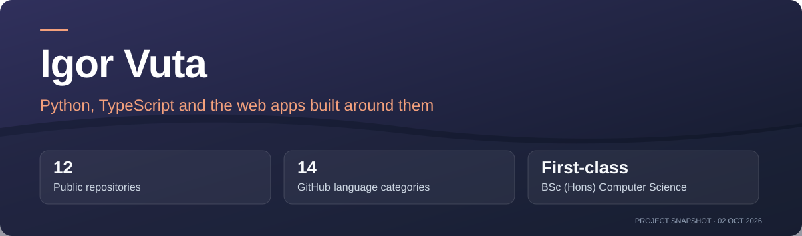
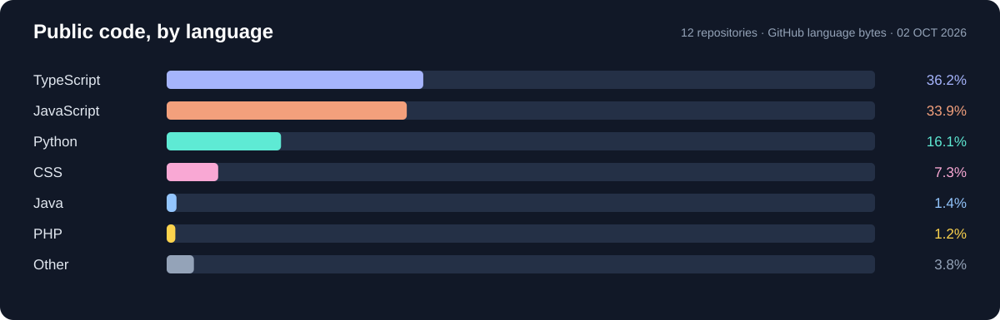

<!-- project-presentation:start -->

**[Portfolio](https://igor-vuta.github.io/portfolio/)** · [Repository activity](https://github.com/igor-vuta/igor-vuta/activity)

**12** Public repositories · **14** GitHub language categories · **First-class** BSc (Hons) Computer Science

*Project facts checked 2 October 2026. Activity badges update from GitHub.*

<!-- project-presentation:end -->

First-Class BSc (Hons) Computer Science · De Montfort University, Leicester, UK

*Life, liberty, and the pursuit of reproducible applications.*

---

## Hi 

I write backends and the web apps that run on top of them, and I have an unreasonable soft spot for the part most people skip: proving the thing actually works.

A benchmark from a single run tells you almost nothing — change the seed and it can tell you the opposite. So when I claim my optimiser beats a greedy baseline, that number comes from 120 scenarios × 30 seeds, reported as a mean with the spread next to it. A result without a distribution is just an anecdote with good lighting.

That habit came out of my degree and never left. Give me a dataset and I'll happily lose an evening to it.

## What I've been building 

### Intelli-Factory — final-year project

A supply-chain matching platform with a **FastAPI + PostgreSQL** backend and a **Next.js/TypeScript** frontend. It ranks manufacturer–logistics offers by a customer-weighted cost, delivery-time and reliability score; a DEAP genetic search cross-checks that score against a greedy cheapest-first baseline.

The interesting part is the trade-off: faster and more reliable offers can cost more. The customer chooses the weights; the deterministic mode exhaustively ranks the available offers, so the genetic search can match that score but cannot improve its optimum. The recorded benchmark covers **3,600 evaluations** (120 scenarios × 30 seeds) against the engine code:

| Metric | Greedy baseline | Optimised | Change |
|---|---|---|---|
| Composite fitness | 0.682 | 0.801 | **+17.5%** |
| Delivery time | 8.02 days | 4.67 days | **41.8% faster** |
| Reliability | 0.824 | 0.891 | **+8.1%** |
| Raw cost | 21,296 KZT | 51,648 KZT | +142.5% — a deliberate trade |

These are recorded benchmark results, not a promise about every real supply chain. The seeded scenarios and exported measurements make the comparison inspectable.

The engine has a pytest regression suite; the application uses Argon2id, server-side sessions and rate limiting. [Recorded benchmark data](https://github.com/igor-vuta/intelli-factory/blob/main/frontend/public/data/benchmark-showcase.json) includes the scenario counts, seeds and measured trade-offs.

**[Live demo](https://intelli-factory.duckdns.org/)** · **[API docs](https://intelli-factory.duckdns.org/api/docs)** · **[Code](https://github.com/igor-vuta/intelli-factory)**

### Applications and tools 

| Project | What it is | Live |
|---|---|---|
| [intelli-factory](https://github.com/igor-vuta/intelli-factory) | Weighted supply-chain matching — FastAPI, PostgreSQL, Next.js, DEAP cross-check | [Visit](https://intelli-factory.duckdns.org/) |
| [DrivePro_2](https://github.com/igor-vuta/DrivePro_2) | Navigation-first Almaty carpooling PWA with route-based matching | [Visit](https://drivepro-almaty.duckdns.org/) |
| [portfolio](https://github.com/igor-vuta/portfolio) | Interactive portfolio with a 3D project showcase | [Visit](https://igor-vuta.github.io/portfolio/) |
| [todo-webapp-refactored](https://github.com/igor-vuta/todo-webapp-refactored) | PHP + MySQL task manager with shared lists and JWT authentication | [Run locally](https://github.com/igor-vuta/todo-webapp-refactored#readme) |
| [drivePro-website](https://github.com/igor-vuta/drivePro-website) | Bilingual (RU/KK) site for an equipment-hire company | [Visit](https://igor-vuta.github.io/drivePro-website/) |
| [currency-exchange-bot](https://github.com/igor-vuta/currency-exchange-bot) | Button-only Telegram bot, API with a scraper fallback | [@currenvy_bot](https://t.me/currenvy_bot_for_demo_bot) |
| [vue-folder-tree](https://github.com/igor-vuta/vue-folder-tree) | Recursive Vue 3 tree component — keyboard nav, ARIA, no dependencies | [Visit](https://igor-vuta.github.io/vue-folder-tree/) |
| [react-starter-pro](https://github.com/igor-vuta/react-starter-pro) | React 19 + Vite starter with the lint/format/hooks/CI boring bits already done | [Visit](https://igor-vuta.github.io/react-starter-pro/) |
| [qubly-landing](https://github.com/igor-vuta/qubly-landing) | Older pixel-perfect landing page. Plain HTML, CSS, jQuery | [Visit](https://igor-vuta.github.io/qubly-landing/) |

### Coursework

| Project | What it demonstrates | Try it |
|---|---|---|
| [student-course-hub](https://github.com/igor-vuta/student-course-hub) | Server-rendered course catalogue and admin CMS with Deno, Oak and SQLite | [Local setup](https://github.com/igor-vuta/student-course-hub#readme) |
| [module-chooser-javafx](https://github.com/igor-vuta/module-chooser-javafx) | JavaFX desktop module selection, MVC and credit tracking | [Desktop setup](https://github.com/igor-vuta/module-chooser-javafx#readme) |

## Code at a glance

*Snapshot: 2 October 2026. GitHub language bytes across public repositories; this shows repository composition, not proficiency or time spent.*

## What I reach for

Alongside those: DEAP for evolutionary algorithms, pandas and NumPy when I'm poking at data, and Recharts when a result needs to be looked at rather than read.

## Currently 

Looking for **entry-level software and web development roles** where I can build useful applications, learn from experienced engineers and test my work properly.

Certified: Meta Front-End Developer · Palo Alto Cybersecurity Foundation · Red Hat RH124.

If you've got a problem where the right approach isn't obvious and someone needs to measure which one actually wins — that's the job I want.

Reach me at [igor_vuta@proton.me](mailto:igor_vuta@proton.me).

---

<picture>
  <source media="(prefers-color-scheme: dark)" srcset="https://raw.githubusercontent.com/igor-vuta/igor-vuta/output/github-snake-dark.svg" />
  
</picture>

*The snake eats my commits so I don't have to.*

